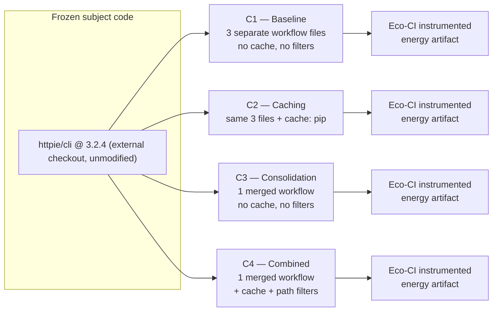
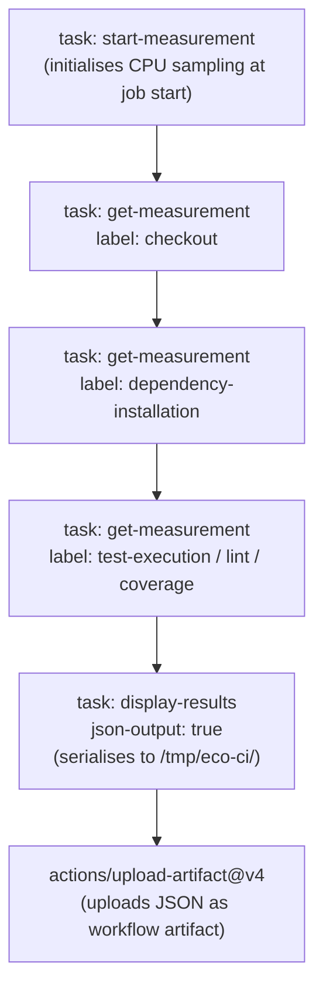
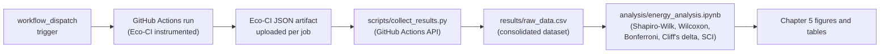

# Greening the Pipeline: An Empirical Comparison of CI/CD Refinement Strategies and Their Carbon Impact Across Open-Source Projects

| | |
|---|---|
| **Student** | Umer Karachiwala |
| **Student ID** | L00196895 |
| **Institution** | Atlantic Technological University (ATU) Donegal, Letterkenny, Co. Donegal, Ireland |
| **Programme** | MSc DevOps |
| **Replication package** | https://github.com/Umer-2612/msc-devops-dissertation |
| **Measurement tool** | Eco-CI Energy Estimation v5 (Green Coding Solutions) |
| **Carbon framework** | Software Carbon Intensity (SCI), ISO/IEC 21031:2024 |

---

## Abstract

Continuous Integration and Continuous Deployment (CI/CD) pipelines build, test, and validate software on every code change, executing on ephemeral cloud virtual machines. At ecosystem scale these pipelines represent a significant and largely unaudited source of energy consumption: recent estimates place the 2024 carbon footprint of the GitHub Actions ecosystem in the hundreds of tonnes of CO₂ equivalent. Developers, meanwhile, have no project-level, evidence-based guidance on which pipeline configuration changes actually reduce carbon, or by how much.

This dissertation addresses that gap through a controlled, within-subjects experiment. Four progressively refined pipeline configurations, a baseline (C1), dependency caching (C2), workflow consolidation (C3), and all three strategies combined including path filtering (C4), are applied to a set of real open-source GitHub Actions projects. Energy is measured directly inside CI using the Eco-CI energy estimation tool, and carbon is computed using the Software Carbon Intensity specification (ISO/IEC 21031:2024). The study answers three research questions: the carbon reduction attributable to each strategy (RQ1), the consistency of those savings across project languages and sizes (RQ2), and the carbon saved per unit of implementation effort (RQ3).

To isolate the effect of language and toolchain from the effect of what a project does, the cross-language comparison holds the application domain constant by studying HTTP-client libraries across Python, JavaScript, Java, and Go, and adds a larger project on the size axis. Pilot measurements on the anchor project (HTTPie CLI, Python) validate the measurement methodology and give initial directional findings: combining caching with consolidation reduced test-matrix energy by 7.1%, driven primarily by a 16.8% reduction in the dependency-installation stage, while CPU-bound test execution remained configuration-stable. A five-region carbon-intensity analysis further shows that runner geography produces a 15.3× carbon differential (Norway versus Singapore) for identical pipelines, an order of magnitude larger than any configuration-level optimisation measured.

**Keywords:** green software engineering, CI/CD, GitHub Actions, carbon emissions, Software Carbon Intensity, Eco-CI, dependency caching, sustainable DevOps.

---

## Table of Contents

1. Introduction
2. Literature Review
3. Methodology
4. Design
5. Results
6. Discussion
7. Conclusion
- References
- Appendix A: Pre-Study Audit
- Appendix B: Reproducibility and Data-Collection Procedure

---

# Chapter 1: Introduction

## 1.1 Purpose

The purpose of this dissertation is to empirically measure and compare the carbon impact of three Continuous Integration and Continuous Deployment (CI/CD) pipeline refinement strategies across open-source projects hosted on GitHub. The three strategies under investigation, dependency caching, workflow consolidation, and path-based trigger filtering, are individually documented in professional practice but have never been systematically compared against each other in a controlled experiment using standardised carbon measurement. This work applies the Software Carbon Intensity (SCI) specification (ISO/IEC 21031:2024) and the Eco-CI energy estimation tool to produce evidence-based recommendations for open-source maintainers seeking to reduce the environmental footprint of their build pipelines.

## 1.2 Background

### 1.2.1 The Energy Cost of Software Infrastructure

Software development infrastructure has grown substantially in both scale and environmental consequence. The International Energy Agency reported that global data centre electricity consumption exceeded 460 TWh in 2022 and is projected to grow further as cloud-native and AI workloads expand (IEA, 2023). Masanet et al. (2020) document that while improvements in hardware efficiency historically offset growing workload volumes, this balance is increasingly under pressure; the efficiency gains of previous decades cannot be assumed to continue indefinitely.

Within this broader cloud infrastructure footprint, Continuous Integration and Continuous Deployment pipelines represent a significant and largely unexamined source of energy consumption. These pipelines, which build, test, and validate software on every code change, execute on cloud virtual machines that are provisioned, run, and discarded with each trigger event. A moderately active open-source repository may generate tens of thousands of workflow runs per year. Alves et al. (2024) characterise this as the "software frugality" problem: as DevOps practices democratise CI/CD through platforms such as GitHub Actions and GitLab CI, the aggregate energy cost of automated pipelines across millions of repositories becomes environmentally significant, yet remains largely invisible to the developers who configure them.

At ecosystem scale, Saavedra, Mendes and Ferreira (2025) estimate the carbon footprint of the entire GitHub Actions ecosystem in 2024 at between 150.5 and 994.9 metric tonnes of CO₂ equivalent (MTCO₂e), with a most likely scenario of 456.9 MTCO₂e. This is the equivalent of the annual electricity consumption of thousands of homes, produced by automated pipelines that most developers have never audited for environmental efficiency.

Taken together, these figures establish that CI/CD is not a peripheral cost of software delivery but a growing and largely invisible line item in the environmental footprint of the software industry, one that scales directly with how often, and how wastefully, pipelines are triggered. That framing motivates the next question: not whether CI/CD carries an energy cost, but why that cost is so much higher than the work being performed requires.

### 1.2.2 Systemic Inefficiency in CI/CD Configuration

The energy cost of CI/CD pipelines is not primarily a consequence of the work performed (tests must run, code must be compiled) but of how pipelines are configured to perform that work. Three patterns account for much of the excess consumption.

**Unconditional dependency reinstallation.** GitHub-hosted runners are ephemeral: every new job starts with a clean virtual machine and must reinstall all project dependencies from scratch. Without explicit caching, a project that runs 50 builds per day reinstalls the same set of packages 50 times, each time consuming network bandwidth and CPU cycles for identical download-and-install operations. Bouzenia and Pradel (2024) found that only 32.9% of GitHub Actions repositories had enabled dependency caching, despite its availability as a first-class feature.

**Fragmented multi-workflow structures.** Mature open-source projects commonly accumulate separate workflow files for testing, linting, and coverage, each of which independently provisions a runner, checks out the full repository, and installs all dependencies. When these stages are structurally independent, the shared setup cost is duplicated for every parallel workflow. Consolidating them into a sequential or partially-parallel single workflow eliminates this duplication.

**Unrestricted trigger events.** A push event on a CI/CD pipeline without path-based filtering triggers a full test suite execution regardless of whether the changed files are relevant to the build. Editing a documentation file or updating a README triggers the same runner provisioning, dependency installation, and test execution as a substantive code change. Bouzenia and Pradel (2024) find that only 20.7% of repositories apply path-based filtering to reduce unnecessary executions.

These patterns are not the product of deliberate decisions to consume energy; they reflect engineering choices made without visibility into their environmental consequences. Pinto and Castor (2017) observe that energy efficiency has historically been treated as a concern for embedded or high-performance computing, not for the typical application developer. Engineers who routinely optimise query latency and memory footprint have no equivalent instinct or toolchain for measuring what a git push costs the planet.

In summary, the three patterns identified here, unconditional reinstallation, fragmented workflows, and unrestricted triggers, are the practical target of this dissertation's three refinement strategies. Each maps directly onto one of the four experimental configurations introduced in Chapter 3: dependency caching addresses the first pattern, workflow consolidation the second, and path-based filtering the third, with a fourth configuration combining all three.

### 1.2.3 The Measurement and Regulatory Gap

Three developments make the measurement of CI/CD carbon impact both feasible and timely.

First, the Green Software Foundation published the Software Carbon Intensity (SCI) specification in 2022, subsequently adopted as ISO/IEC 21031:2024 (Green Software Foundation, 2024). The SCI standard provides a reproducible, standardised formula (SCI = ((E × I) + M) / R) for expressing the carbon intensity of a unit of software functionality. It is designed to be comparable across different software systems and measurement contexts, enabling like-for-like comparison of pipeline configurations.

Second, the Eco-CI Energy Estimation tool (Green Coding Solutions, 2023) makes energy measurement inside cloud CI environments practically achievable. GitHub-hosted runners do not expose hardware-level energy counters; Eco-CI addresses this by using a machine learning model trained on the SPECpower database to estimate energy consumption from CPU utilisation data, producing per-stage energy measurements in joules without requiring physical instrumentation. A 2026 IEEE study applying this class of tool to 204 open-source Java projects found that enabling dependency caching reduced CI energy consumption by 30% on average for Maven projects and by over 90% in some Gradle cases, directly validating caching as a high-impact intervention (IEEE, 2026).

Third, the EU Corporate Sustainability Reporting Directive (CSRD), effective from January 2024, requires large organisations to disclose Scope 3 emissions, a category that includes cloud infrastructure usage (European Commission, 2022). As sustainability reporting obligations mature, the energy cost of CI/CD pipelines will increasingly appear in corporate carbon accounts. This regulatory pressure creates organisational incentives for pipeline efficiency that complement the environmental motivation.

Despite these developments, a critical gap remains. No existing study has experimentally applied and compared multiple CI/CD pipeline refinement strategies across diverse real-world projects using standardised carbon measurement. Saavedra et al. (2025) estimate ecosystem-scale footprints but provide no project-level guidance. Bouzenia and Pradel (2024) document optimisation adoption rates and estimate VM time savings, but do not translate these into carbon units. Claßen et al. (2023) demonstrate carbon-aware temporal scheduling but do not evaluate pipeline configuration changes. Alamer and Alharbi (2025) systematically review the literature and identify the absence of empirical comparative data as the primary gap. That is the gap this dissertation fills.

In summary, the standard, the tool, and the regulatory pressure now each exist independently. What has not yet existed is a study that puts all three together to test, in a controlled way, which specific pipeline changes are actually worth making, and by how much.

### 1.2.4 Problem Statement

The result is a persistent gap between what is now measurable and what is actually known. Pipelines continue to reinstall dependencies, run fragmented workflows, and trigger on irrelevant changes (Section 1.2.2), not because these inefficiencies are unknown in principle, but because no study has quantified their carbon cost in a way a maintainer can act on. The instruments needed to close this gap exist (Section 1.2.3), yet nobody has applied them systematically, across more than one project and more than one strategy, using a standardised metric that permits genuine comparison. The problem this dissertation addresses is therefore concrete: open-source maintainers who want to reduce the carbon footprint of their CI/CD pipelines currently have no evidence-based way to decide which of several plausible configuration changes is worth making first, or whether that decision even holds outside the specific project where a saving happens to have been observed.

## 1.3 Research Questions

This dissertation is organised around three research questions, each designed to address a distinct dimension of the pipeline carbon measurement problem:

**RQ1:** What carbon reduction does each of the three pipeline refinement strategies (dependency caching, workflow consolidation, and path-based trigger filtering) produce compared to an unrefined baseline in real open-source GitHub Actions projects?

**RQ2:** Do the carbon savings from these refinement strategies remain consistent across projects of different sizes, programming languages, and build complexities, or does the effectiveness of each strategy vary by project type?

**RQ3:** Which refinement strategy produces the largest measured carbon reduction relative to implementation effort, and what evidence-based recommendations can be developed for open-source maintainers?

RQ1 establishes whether individual strategies produce measurable, statistically significant carbon reductions. RQ2 tests whether findings from one project type generalise to others, and is addressed with a design that holds the application domain constant while varying language and ecosystem (Section 3.2). RQ3 synthesises the comparative evidence into actionable recommendations, accounting for both the magnitude of carbon saving and the implementation cost of each strategy.

### 1.3.1 Objectives

To answer the research questions above, this dissertation pursues the following objectives:

- Instrument four progressively refined GitHub Actions pipeline configurations, baseline, caching, consolidation, and combined, with the Eco-CI energy estimation tool across a set of real open-source projects.
- Convert the measured energy consumption of each configuration into a standardised carbon figure using the Software Carbon Intensity (SCI) specification (ISO/IEC 21031:2024).
- Statistically compare each refinement strategy against the unrefined baseline to establish which produce a measurable and significant carbon reduction (addressing RQ1).
- Assess whether the magnitude and direction of each strategy's effect holds across projects of different programming languages and sizes (addressing RQ2).
- Rank the three strategies by carbon saved per unit of implementation effort and translate that ranking into evidence-based recommendations for maintainers (addressing RQ3).

### 1.3.2 Main Contributions

This dissertation is expected to make the following contributions, confirmed in full once the complete dataset is analysed (Chapter 7):

1. The first multi-strategy, cross-project empirical comparison of CI/CD pipeline refinement strategies under a standardised carbon metric (SCI / ISO/IEC 21031:2024).
2. A replicable green CI/CD audit methodology, comprising an Eco-CI instrumentation pattern, a pre-study audit checklist, data-collection scripts, and analysis notebooks, published as an open replication package.
3. A cross-language experimental design that isolates language and ecosystem effects from application purpose by holding the HTTP-client domain constant across the projects studied.
4. Evidence-based, effort-weighted recommendations for open-source maintainers on which pipeline configuration change is worth making first.
5. A multi-region SCI analysis quantifying the carbon impact of runner geographic location relative to configuration-level optimisation.

## 1.4 Scope and Limitations

This dissertation focuses on GitHub Actions as the CI/CD platform and restricts analysis to publicly available open-source repositories hosted on GitHub. The study examines pipeline-level configuration changes only; it does not address test-suite restructuring, application-level code optimisation, or infrastructure-level interventions such as geographic runner selection or temporal scheduling. Carbon measurement is performed using Eco-CI for energy estimation and the SCI specification for carbon intensity calculation; the inherent limitations of model-based energy estimation in shared cloud environments are acknowledged and addressed in the Methodology chapter.

The scope is bounded to the three refinement strategies identified from the literature as having both documented adoption precedent and plausible energy impact: dependency caching, workflow consolidation, and path-based trigger filtering. Strategies requiring non-standard infrastructure, such as self-hosted runners or private registries, are excluded to ensure reproducibility.

## 1.5 Report Outline

- **Chapter 2 (Literature Review)** surveys the literature across four thematic areas and identifies the specific contribution this dissertation makes.
- **Chapter 3 (Methodology)** describes the research design and the reasoning behind it: the rationale for a controlled, within-subjects experiment; project selection criteria; the four experimental configurations at a conceptual level; the SCI carbon-calculation framework; the data collection procedure; and the ethical and reproducibility considerations.
- **Chapter 4 (Design)** presents the concrete technical implementation that realises the methodology: the pipeline architecture for each configuration, the Eco-CI instrumentation pipeline, the measurement stage boundaries, and a worked example of the SCI calculation, illustrated with diagrams.
- **Chapter 5 (Results)** sets out the statistical analysis approach, then presents the energy and carbon measurements for each project and configuration: descriptive statistics, significance tests, SCI scores, and the multi-region carbon intensity analysis.
- **Chapter 6 (Discussion)** interprets the findings in relation to the three research questions, compares results to prior literature, and identifies the principal threats to validity.
- **Chapter 7 (Conclusion)** confirms the contributions of the dissertation, states the practical recommendations for open-source maintainers, acknowledges the limitations of the study, and identifies directions for future work.

---

# Chapter 2: Literature Review

## 2.1 Introduction

This chapter reviews the body of literature relevant to the measurement and reduction of carbon emissions in software CI/CD pipelines. The review is organised thematically across four areas: ecosystem-scale measurement of CI/CD energy and carbon footprints; energy profiling of individual CI stages and build tools; carbon-aware scheduling and infrastructure-level strategies; and measurement tools, standards, and systematic reviews. A gap analysis in Section 2.6 identifies the precise contribution this dissertation makes to the existing body of knowledge, and Section 2.7 draws out the single takeaway that motivates the research design in Chapter 3.

The review draws on peer-reviewed papers from IEEE Xplore, the ACM Digital Library, and verified open-access preprints from arXiv, spanning the period 2016 to 2026. Search terms included "CI/CD carbon emissions", "GitHub Actions energy", "green software engineering", "software carbon intensity", "Eco-CI", "sustainable DevOps", and "pipeline energy consumption". Papers were included where they directly measure, estimate, or provide tooling for CI/CD energy or carbon consumption, or where they provide foundational methodology (statistical approaches, measurement standards) that this dissertation applies.

## 2.2 Ecosystem-Scale Measurement of CI/CD Energy and Carbon

### 2.2.1 The GitHub Actions Ecosystem Footprint

Saavedra, Mendes and Ferreira (2025), in "Environmental Impact of CI/CD Pipelines," apply the Cloud Carbon Footprint (CCF) framework to quantify the carbon and water footprints of the entire GitHub Actions ecosystem in 2024. **One-line takeaway: at ecosystem scale, GitHub Actions produces an estimated 456.9 MTCO₂e per year, and geographic runner placement is the single largest lever available to reduce it.**

Their dataset comprises 2,226,729 workflow runs from 18,683 public repositories, covering 3,446,572 jobs. Operational carbon estimates range from 150.5 MTCO₂e under the most optimistic assumption (runners located in low-carbon Norwegian datacentres) to 994.9 MTCO₂e under the most pessimistic (Indian grid intensity), with the most likely scenario at 456.9 MTCO₂e. The water footprint most likely scenario is 5,738.2 kiloliters.

The paper identifies three mitigation strategies at the ecosystem level: deploying runners in low-carbon regions (up to 67.1% reduction), temporal shifting of scheduled runs (3.9% reduction), and reducing repository sizes. These are high-level strategic recommendations rather than actionable project-level guidance; the study explicitly acknowledges that it estimates resource usage rather than directly measuring it, with only 6.5% of workflows successfully re-executed for validation.

This paper establishes the significance of the problem at scale but does not address how individual maintainers should configure their pipelines. This dissertation addresses that project-level gap directly.

### 2.2.2 Large-Scale Energy Analysis of GitHub Workflows

Alves et al. (2024), in "Software Frugality in an Accelerating World: the Case of Continuous Integration," conduct the first large-scale analysis of the energy consumption of GitHub Actions workflows by executing workflows locally on a controlled server to measure their energy consumption directly. **One-line takeaway: aggregate CI energy consumption is highly skewed across projects, and developers currently have no tooling to see this cost at the point where they make configuration decisions.**

Their study covers multiple open-source repositories and finds an average aggregated CI energy consumption of 22 kWh per project, with average CO₂ emissions of 10.5 kg, equivalent to the emissions from driving approximately 100 kilometres in a typical European car. The paper frames this as a software frugality problem: CI democratisation through GitHub and GitLab has made automated pipelines ubiquitous, but without developer awareness of their energy cost.

The study characterises the distribution as highly skewed: a small number of CI-intensive projects account for disproportionately large energy shares. The authors conclude that developers should have better tools to anticipate and reflect on the environmental consequences of CI configuration choices.

This work provides important empirical grounding for the aggregate energy footprint of CI at the project level, but does not compare refinement strategies or translate energy into standardised carbon units using the SCI framework.

### 2.2.3 Energy Consumption of Continuous Integration in Java Projects

A 2026 IEEE study, "On the Energy Consumption of Continuous Integration in Open-Source Java Projects" (Document 11500151), provides the first comprehensive baseline of CI energy use through a large-scale analysis of 204 open-source Java projects, measuring energy consumption under Maven and Gradle build systems with repeated measurements. **One-line takeaway: dependency caching cuts CI energy by 30% on average and by over 90% in the best cases, making it the single strongest empirically validated intervention in the literature.**

The study finds that energy use is highly skewed: while most projects consume energy modestly, a minority of CI-intensive systems reach annual CI energy footprints of hundreds of kilowatt-hours, comparable to a quarter of an average EU household's electricity use.

The finding most relevant to this study is that enabling dependency caching reduced CI energy consumption by 30% on average in Maven projects, and by over 90% in some Gradle cases. This is the strongest empirical validation currently available for dependency caching as a high-impact CI refinement strategy, and it directly supports the inclusion of caching as **Configuration C2** in this dissertation's design. The study is restricted to Java projects using Maven and Gradle; this study extends the investigation to Python, JavaScript, and Go, and adds the orthogonal strategies of workflow consolidation and trigger filtering, neither of which the IEEE study evaluates.

### 2.2.4 Section Summary

Together, these three studies establish that the CI/CD carbon problem is real, large, and skewed towards a minority of intensive projects, and that at least one intervention (caching) already has strong empirical backing in a single-language context. None of the three, however, tests more than one strategy, and none applies a standardised carbon metric consistently across configurations, which is the specific gap this dissertation's four-configuration design is built to close.

## 2.3 Energy Profiling of Individual CI Stages

### 2.3.1 Build Automation Tool Energy Profiles

De Medeiros, Lefeuvre, Combemale and Perez (2025), in "Evaluating the Energy Profile of Tasks Managed by Build Automation Tools in Continuous Integration Workflows," investigate the energy consumption of tasks managed by Apache Maven and Gradle within GitHub Actions CI workflows, using the SmartWatts hardware performance counter tool at 2 Hz sampling. **One-line takeaway: testing is the dominant CI energy stage (36 to 47% of total), and project size does not reliably predict per-task energy consumption.**

Their dataset comprises 1,167 CI workflows from popular Java projects, yielding 183,355 analysed tasks. Key findings: Maven and Gradle tasks represent 24 to 28% of total CI workflow energy; testing-related tasks consume the most energy (47% for Maven, 36% for Gradle); and project size does not strongly predict per-task energy consumption (Cliff's Delta predominantly negligible).

The paper is noteworthy for its measurement rigour (direct hardware measurement via SmartWatts rather than estimation) but is limited to CPU energy (RAM, disk, and network excluded), to Java projects only, and to a clean-environment execution design that deliberately excludes caching as a worst-case scenario. The authors identify as future work the quantification of energy savings from caching.

This study follows up on that identified future work: it applies caching, measures the before-and-after difference, and does so across multiple languages, enabling a cross-language comparison that de Medeiros et al. did not attempt.

### 2.3.2 Platform and Language Energy Comparison

Niang (2024), in "CI/CD Pipelines: Good Software Development Practice, But Green?," examines CI/CD pipeline energy consumption by varying three parameters (CI platform, programming language, and build tool) using a single small-scale application of 455 lines of code: GitHub Actions versus GitLab CI/CD, Java versus Python. **One-line takeaway: GitHub Actions is measurably less energy-intensive than GitLab CI/CD for an identical workload, and Eco-CI is a workable instrument for capturing that difference.**

Energy is estimated using the Eco-CI tool. Key findings: GitHub Actions averaged 13.36 joules per execution compared to GitLab's 21.81 joules; Java averaged 11.36 joules versus Python's 14.62 joules. The study acknowledges its primary limitation explicitly: a single tiny project with no statistical generalisation.

Beyond the headline platform comparison, the study is significant for this dissertation because it is one of the few published uses of Eco-CI outside the tool's own documentation, and because its language comparison (Java lower-energy than Python for the same task) raises a question this dissertation's cross-language design is well placed to probe further: whether that language-level gap narrows or widens once a real, non-trivial dependency graph and test suite are involved, rather than a 455-line demonstration program. Niang's platform finding also has a direct design consequence: because GitHub Actions is already the lower-energy platform, any savings measured within this study represent genuine additional reduction on top of a platform choice that is not itself the source of excess energy.

This paper demonstrates the practical application of Eco-CI as a measurement instrument in a CI/CD research context, providing a methodological precedent for this dissertation's use of the same tool. It also establishes GitHub Actions as the lower-energy platform relative to GitLab for the same workload, justifying the focus on GitHub Actions in this study.

### 2.3.3 Energy Measurement in Containerised CI/CD

Ehlers et al. (2026), in "PPTAM𝜂: Energy Aware CI/CD Pipeline for Container Based Applications," present PPTAM𝜂, an automated pipeline that integrates power and energy measurement into GitLab CI for containerised API systems. **One-line takeaway: per-commit energy visibility is achievable with direct hardware power probes on self-hosted infrastructure, but that fidelity comes at the cost of portability to the shared, GitHub-hosted runners most open-source projects actually use.**

The system coordinates load generation, container monitoring, and hardware power probes to collect comparable metrics at each commit. The pipeline makes energy visible to developers on a per-commit basis, enabling version comparison and trend analysis. Their evaluation on a JWT-authenticated API across four commits demonstrates the methodology's practical applicability.

The per-commit framing is the paper's most transferable idea: PPTAM𝜂 treats energy the way most teams already treat test coverage or build time, as a number that appears on every commit and can be watched for regressions over time. This dissertation does not adopt PPTAM𝜂's hardware-probe architecture, since that requires infrastructure open-source maintainers on free GitHub-hosted runners do not control, but the underlying idea, that carbon visibility is most useful when it is continuous rather than a one-off audit, motivates the future-work recommendation in Section 7.4 for a reusable Eco-CI-based workflow template that reports SCI on every push.

PPTAM𝜂 is architecturally distinct from this dissertation's approach: it targets containerised microservices on self-hosted infrastructure with direct hardware power probes, while this dissertation targets GitHub-hosted runners using the Eco-CI model-based approach. The two approaches are complementary rather than competing: PPTAM𝜂 achieves higher measurement fidelity on self-hosted systems; Eco-CI enables measurement on shared cloud infrastructure where hardware access is unavailable. This dissertation extends Eco-CI's applicability to a multi-configuration, multi-strategy comparative study, which PPTAM𝜂 does not address.

### 2.3.4 Why Scale Matters

Two findings from this section, taken together, motivate a design decision made in Chapter 3. De Medeiros et al. (2025) find that project size does not strongly predict per-task energy consumption within Java projects (Section 2.3.1), while Alves et al. (2024) and the IEEE (2026) study both find that a small minority of CI-intensive projects account for a disproportionate share of aggregate CI energy (Sections 2.2.2 to 2.2.3). Read together, these results suggest that the relationship between project scale and CI carbon footprint is not linear and cannot be assumed from a single small anchor project: a larger, more CI-intensive project might behave like the anchor, or it might belong to the disproportionate minority the aggregate studies describe. This is the literature-grounded reasoning behind including a larger, differently-scoped project on the size axis of this study's design (Section 3.2.2), rather than restricting the cross-project comparison to same-size HTTP-client libraries alone.

## 2.4 Carbon-Aware Scheduling and Infrastructure Strategies

An orthogonal class of CI/CD carbon reduction strategies focuses not on what the pipeline does but on when and where it runs. Claßen, Thierfeldt, Tochman-Szewc, Wiesner and Kao (2023), in "Carbon-Awareness in CI/CD," propose a system architecture for carbon-aware CI/CD services that aligns workflow execution with periods of low-carbon energy availability. **One-line takeaway: shifting CI/CD execution to low-carbon regions and low-carbon time windows can cut carbon by up to 31.2% without changing what the pipeline actually does.**

Using real carbon intensity data from WattTime across twelve regions and 7,392 GitHub Actions workflow executions from ten repositories, they find that location shifting alone achieves a 25.31% carbon reduction, with user-supplied execution deadlines enabling combined savings approaching 31.2%. The approach treats CI/CD execution as a schedulable workload that can be deferred within developer-specified tolerances, analogous to demand response in energy systems.

The mechanism is worth setting out in a little more detail, because it clarifies exactly what this dissertation does not attempt. WattTime supplies near-real-time marginal carbon intensity forecasts per grid region; Claßen et al.'s scheduler consumes these forecasts and, for any workflow run that carries a developer-supplied deadline (for example, "must complete within four hours"), searches for the lowest-carbon feasible start time within that window before dispatching the job to a runner. The 25.31% figure comes purely from choosing a better region for a fixed job; the additional headroom up to 31.2% comes from also choosing a better time within that region. Neither lever touches the pipeline's own configuration, which is the point of contrast with this dissertation: Claßen et al. hold the pipeline fixed and vary region and time, while this dissertation holds region and time fixed (via `workflow_dispatch` on a single runner location) and varies the pipeline configuration.

At ecosystem scale, Saavedra, Mendes and Ferreira (2025) find that deploying runners in low-carbon regions is the single most impactful intervention available, with up to 67.1% carbon reduction from regional selection relative to the worst-case (India-region) scenario.

These spatial and temporal scheduling strategies address the carbon intensity of the electricity (I in the SCI formula) rather than the energy consumed (E). This dissertation addresses the orthogonal dimension: reducing E through pipeline configuration changes. The two approaches are complementary: configuration refinement reduces the work performed; scheduling reduces the carbon cost of that work. Combining both represents the most complete available reduction strategy, but each is independently actionable. For open-source maintainers who do not control runner geography (the majority using free GitHub-hosted runners), configuration refinement is the primary available lever.

## 2.5 Measurement Tools, Standards, and Systematic Reviews

### 2.5.1 The Software Carbon Intensity Standard

The Software Carbon Intensity specification, published by the Green Software Foundation in 2022 and subsequently adopted as ISO/IEC 21031:2024, defines a standardised, reproducible metric for expressing the carbon intensity of a unit of software functionality (Green Software Foundation, 2024). **One-line takeaway: SCI gives this study a comparison metric that cannot be gamed by offsets, but it provides no CI/CD-specific guidance of its own.**

The formula SCI = ((E × I) + M) / R expresses operational energy (E), grid carbon intensity (I), embodied hardware carbon (M), and a functional unit (R). Unlike absolute carbon footprint metrics, SCI cannot be reduced to zero through offsets or neutralisation credits; only genuine efficiency improvements reduce the score. This property makes it appropriate for comparing pipeline configurations, as it is insensitive to accounting choices.

The specification provides the measurement framework for this dissertation but offers no CI/CD-specific guidance and no empirical data on what configuration changes actually reduce SCI in practice. This dissertation provides that empirical data.

### 2.5.2 Eco-CI Energy Estimation

Eco-CI (Green Coding Solutions, v5.x) is a GitHub Actions action that estimates per-stage energy consumption inside CI workflows without requiring hardware instrumentation (Green Coding Solutions, 2023). **One-line takeaway: Eco-CI is the only practical way to get per-stage energy figures on shared GitHub-hosted runners, at the cost of being a model-based estimate rather than a hardware measurement.**

It uses a machine learning model trained on the SPECpower benchmark database to map CPU utilisation to power draw, integrating over elapsed time to produce per-stage energy values in joules. The model is appropriate for GitHub Actions `ubuntu-latest` runners, which run on Intel Xeon Platinum processors on Azure infrastructure, a hardware configuration well characterised in the SPECpower corpus.

Any systematic model bias affects all four experiment configurations equally and does not distort relative comparisons between configurations, which is this dissertation's primary concern. Niang (2024) applies Eco-CI in a prior CI/CD energy comparison study, providing a methodological precedent for its use in this research context. The mechanism by which Eco-CI derives energy is described in detail in Chapter 4.

### 2.5.3 GitHub Actions Resource Usage Analysis

Bouzenia and Pradel (2024), in "Resource Usage and Optimization Opportunities in Workflows of GitHub Actions," provide the most comprehensive prior empirical study of resource usage in GitHub Actions. **One-line takeaway: caching and path filtering are both under-adopted relative to their availability, which is direct evidence that maintainers lack the guidance this dissertation aims to provide.**

Analysing 952 repositories, 1.3 million workflow runs, and 3.7 million jobs, they find that 91.2% of resources are consumed by testing and building. They document adoption rates for six optimisation strategies: caching (32.9% adoption), fail-fast (75.9%), cancel-in-progress (10.1%), skip-workflow (9.7%), path filtering (20.7%), and custom timeout (14.0%), and estimate the VM time savings each produces. This study provides the empirical baseline for understanding which strategies practitioners actually use and their relative VM time impact.

The 20.7% path-filtering adoption figure is the direct empirical motivation for including path-based trigger filtering as part of **Configuration C4** in this dissertation: fewer than one in four repositories in Bouzenia and Pradel's sample use it, despite it being a native GitHub Actions feature that prevents entire runs, not just individual stages, from executing.

Two limitations stand out: the study measures VM time and monetary cost rather than energy or carbon, and it estimates optimisation impact retrospectively from historical data rather than running a controlled experiment. Both of those are things this study does differently.

### 2.5.4 Systematic Review of Sustainable DevOps

Alamer and Alharbi (2025), in "Sustainable DevOps: A Systematic Literature Review on Reducing Energy Footprint in Continuous Integration and Deployment (CI/CD) Pipelines," conduct a systematic literature review of 50 studies (2020 to 2025) on sustainability in DevOps CI/CD pipelines. **One-line takeaway: the field has moved from hardware profiling to ML-based estimation, but still lacks standardised measurement and empirical comparative data, which is precisely the gap this dissertation targets.**

They identify a methodological shift from hardware-based profiling (RAPL) to ML prediction models, and classify techniques into three categories: carbon-aware scheduling, test-suite optimisation, and lightweight build strategies. The review concludes by identifying the absence of standardised measurement and empirical comparative data as the primary gap in the field, which is precisely what this study addresses.

The review also notes that practical guidance for developers is largely absent from the literature. Existing studies either characterise the problem at scale or propose theoretical frameworks; none provide the project-level experimental evidence that developers need to justify specific configuration choices. This dissertation provides that evidence.

## 2.6 Gap Analysis

### Cross-Paper Comparison

| Dimension | Saavedra et al. (2025) | de Medeiros et al. (2025) | Alves et al. (2024) | Bouzenia & Pradel (2024) | Claßen et al. (2023) | IEEE (2026) |
|---|---|---|---|---|---|---|
| **Scale** | 18,683 repos (ecosystem) | 1,167 workflows | Multiple repos | 952 repos | 10 repos | 204 Java repos |
| **What measured** | Carbon + water (estimated) | Per-task CPU energy (J) | Energy per project (kWh) | VM time + cost | Relative carbon intensity | Energy per project (kWh) |
| **Intervention tested** | None (observational) | None (profiling only) | None (characterisation) | None (retrospective) | Temporal scheduling only | Caching only |
| **Multiple strategies compared** | No | No | No | No (adoption rates only) | No | No |
| **Uses SCI standard** | Referenced | No | No | No | No | No |
| **Multi-language** | Yes (mixed) | No (Java only) | Yes (mixed) | Yes (mixed) | Yes (mixed) | No (Java only) |
| **Design type** | Observational | Observational (profiling) | Observational | Observational (retrospective) | Controlled (scheduling) | Controlled (caching only) |
| **Sample size per condition** | N/A (ecosystem-wide) | N/A (per-task) | N/A (per-project) | N/A (adoption survey) | 7,392 runs, no per-condition paired design | Not reported per condition |
| **Actionable project-level guidance** | Indirect | Limited | Limited | Moderate | Limited | Partial (caching only) |

The two added dimensions matter for positioning this dissertation methodologically, not just thematically. Every prior study in this table is either purely observational or, where an intervention is tested (Claßen et al.'s scheduling, the IEEE study's caching), evaluated without the paired, repeated-measures statistical design (Section 5.2) this dissertation applies. None reports a per-condition sample size sufficient for the kind of significance and effect-size testing (Wilcoxon signed-rank, Cliff's delta) that a controlled comparison of four configurations requires.

### The Unified Gap

No existing study has, together:
1. Experimentally applied multiple CI/CD pipeline refinement strategies (not just documented adoption rates), evaluated as a controlled within-subjects comparison rather than an observational survey;
2. Across diverse real-world open-source projects in multiple languages, holding application domain constant where possible to avoid confounding language with purpose;
3. Measuring actual carbon impact using a standardised methodology (SCI), rather than energy alone or an ecosystem-level carbon estimate;
4. Comparing strategies against each other, and against a common baseline, to identify relative effectiveness and rank them by effort.

Each prior paper addresses a piece of this puzzle: Saavedra et al. (2025) establish the scale of the ecosystem problem and show regional selection dominates all other levers, but not what an individual maintainer without regional control should do instead; de Medeiros et al. (2025) identify which CI stages consume the most (testing) and show project size is a weak predictor on its own, but do not test any intervention that would reduce that consumption; Alves et al. (2024) measure aggregate project-level energy and expose the skewed distribution across projects, but not configuration-level interventions that a maintainer could apply; the IEEE (2026) study validates caching rigorously but only in Java, leaving open whether the effect holds in other ecosystems or alongside other strategies; Bouzenia and Pradel (2024) report adoption rates and estimated VM time savings that reveal caching and path filtering are both under-used, but not their carbon cost; and Claßen et al. (2023) address when and where to run a pipeline, deliberately leaving what the pipeline does unchanged. No paper in this review isolates workflow consolidation as a standalone, measured intervention at all; the closest is Bouzenia and Pradel's observation that fragmented workflows exist at scale, without ever testing the effect of merging them. That absence is what **Configuration C3** in this dissertation's design fills directly.

This dissertation occupies the intersection. It uses SCI (ISO/IEC 21031:2024) as the measurement framework, Eco-CI as the instrument, and applies the pipeline configuration changes identified in the literature to conduct the first experimental, cross-project, multi-strategy comparison with standardised carbon measurement.

## 2.7 Summary and Key Takeaway

Drawing the sections above together, three conclusions carry forward into the research design in Chapter 3. First, the literature strongly validates dependency caching as an effective intervention (Section 2.2.3) but has never tested it outside a single-language context, nor alongside other strategies. Second, the largest carbon lever identified anywhere in the literature is not a pipeline configuration change at all but runner geography (Sections 2.2.1 and 2.4), which sets a realistic ceiling on what configuration-level refinement alone should be expected to achieve, and is precisely why this dissertation treats the multi-region SCI analysis (Section 4.6, Section 5.6) as a companion finding rather than the primary result. Third, and most directly, no study has combined a controlled, within-subjects, multi-strategy design with a standardised carbon metric across more than one project or language (Section 2.6); this is the specific, actionable gap that the four-configuration, cross-language design introduced in Chapter 3 is constructed to close.

---

# Chapter 3: Methodology

## 3.1 Research Design

Chapter 2 concluded that no existing study combines a controlled, multi-strategy comparison with a standardised carbon metric across more than one project or language (Section 2.7). Closing that gap requires a design that can attribute an observed change in energy directly to a specific configuration change, rather than to noise, project choice, or measurement drift. A quantitative experimental design, applied consistently to the same subject code across configurations, is the only way to make that attribution defensible; an observational survey of existing projects (as in Saavedra et al., 2025, or Bouzenia and Pradel, 2024) can describe adoption patterns but cannot isolate cause and effect the way this dissertation's research questions require.

This dissertation therefore adopts a quantitative experimental research design. The study is empirical: it collects measured data from real CI/CD pipeline executions rather than relying on simulation, estimation from existing datasets, or qualitative analysis. The design follows the controlled experiment approach described by Wohlin et al. (2012) for software engineering research: a baseline configuration is established, independent variables (pipeline refinement strategies) are applied one at a time, and the dependent variable (energy consumption and the derived SCI carbon score) is measured under controlled conditions for each configuration.

The study uses a within-subjects design: each project is measured under all four configurations (C1 to C4), enabling paired statistical comparisons that eliminate between-project variability as a confound.

## 3.2 Project Selection

### 3.2.1 Selection Criteria

Projects are selected from public GitHub repositories using the following inclusion criteria.

| Criterion | Requirement | Rationale |
|---|---|---|
| CI platform | GitHub Actions only | Eco-CI targets GitHub-hosted runners |
| Runner type | GitHub-hosted `ubuntu-latest` | Eco-CI's SPECpower model targets this hardware profile |
| Stars | > 500 | Indicates real-world active use |
| Last commit | Active within 3 months of study | Ensures maintained CI configuration |
| Test suite | Automated tests executing in CI | Testing is the dominant energy-consuming stage |
| Licence | MIT, Apache 2.0, BSD, or equivalent | Required for forking and workflow modification |
| Dependency manager | pip, npm, Maven, Gradle, or Go modules | Enables the caching strategy in each ecosystem |
| Build isolation | Runs on Ubuntu with no secrets, external services, browsers, or GPUs | Ensures the pipeline is reproducible and self-contained |
| No self-hosted runners | Confirmed `runs-on: ubuntu-latest` | Self-hosted runners differ in hardware profile |

*Table 3.1: Project inclusion criteria and their rationale.*

Projects are excluded where they use only scheduled (cron) triggers without push or pull-request triggers, where workflows are encrypted or Actions permissions are restricted, or where the repository is a monorepo with more than roughly twenty workflow files, whose complexity exceeds the scope of the study.

### 3.2.2 Comparison Strategy for RQ2

RQ2 asks whether the savings are consistent across languages and sizes. A naive design would compare projects that differ in both language and purpose at once, which confounds the two: any observed difference could be attributed either to the language and toolchain or to what the project actually does. To avoid this, the study separates the two axes.

The primary arm holds the application domain constant and varies only language and ecosystem. It does this by studying HTTP-client libraries, a well-defined and comparable class of project, implemented in different languages. Comparing HTTPie (Python) against a JavaScript, a Java, and a Go HTTP client isolates the effect of language and build toolchain on each strategy's effectiveness, because the projects perform the same kind of work.

A secondary arm addresses the size axis, motivated directly by the literature reviewed in Section 2.3.4: because project size does not reliably predict per-task energy on its own, and a minority of CI-intensive projects account for a disproportionate share of aggregate footprint, the effect measured on a small anchor project cannot be assumed to hold at scale. One larger project of a different type is included specifically to test whether the strategy effects hold as project size and build complexity increase. Because this project differs in domain, it is analysed as a size-axis observation rather than as part of the controlled cross-language comparison.

### 3.2.3 Selected Projects

The study applies the four-configuration protocol to the following projects. Projects are instrumented in sequence, and the number completed depends on the remaining timeline; the Python anchor plus the JavaScript and Java parallels form the committed core that is sufficient for a cross-language claim, with the Go parallel and the size-axis project included as time permits.

| # | Project | Language | Ecosystem / manager | Licence | Role |
|---|---|---|---|---|---|
| 1 | HTTPie CLI | Python | pip (`setup.cfg`) | BSD-3 | Anchor; pilot complete |
| 2 | got | JavaScript / TypeScript | npm | MIT | Cross-language parallel |
| 3 | Retrofit | Java | Gradle | Apache 2.0 | Cross-language parallel |
| 4 | Resty (go-resty) | Go | Go modules | MIT | Cross-language parallel (time permitting) |
| 5 | Larger project (size axis) | to be confirmed | Maven or npm | Permissive | Size-axis observation (time permitting) |

*Table 3.2: Projects selected for the study, their role, and the ecosystem exercised.*

Projects 2 to 4 are all HTTP-client libraries, matching the domain of the anchor. Each satisfies the inclusion criteria: a permissive licence, a self-contained test suite that runs on `ubuntu-latest` without external services (for example, got and Retrofit spin up local mock servers rather than calling the network), and a tagged release to pin against. Project 5 is selected later from the size-axis candidates and is reported only if the schedule allows. Bibliographic references for each project repository are given alongside HTTPie's in the References section.

### 3.2.4 HTTPie CLI: The Anchor Project

HTTPie CLI (https://github.com/httpie/cli) is a production-grade Python HTTP client at version 3.2.4. Its pre-study GitHub Actions configuration consists of three independent workflow files (`tests.yml`, `code-style.yml`, `coverage.yml`) that each reinstall all project dependencies from scratch on every trigger, with no caching strategy. This is representative of how mature Python open-source projects accumulate CI configuration without revisiting default behaviours over time, and it makes all three refinement strategies applicable.

For every configuration, the research workflow checks out `httpie/cli` at the fixed tag `3.2.4` externally and runs the project's own `make` targets, without modifying the project's source. This keeps the subject code frozen and identical across all four configurations, so the only variable between C1 and C4 is the pipeline configuration itself. The same fixed-tag, external-checkout approach is applied to every other project. The concrete implementation of this pattern is described in Chapter 4.

### 3.2.5 Cross-Ecosystem Considerations

Two points affect how the strategies are compared across languages, and both are reported alongside the results rather than smoothed over.

The consolidation strategy (C3) applies only to projects that ship more than one workflow file, because it merges separate workflows into one. A project whose CI is already a single workflow, such as got, has nothing to consolidate; for such a project C1 and C3 are structurally identical and only caching (C2) and the combined configuration (C4) represent genuine change. Which projects support a consolidation comparison is stated explicitly in the results.

Dependency caching (C2) is implemented with the idiomatic mechanism of each ecosystem: `cache: pip` for Python, `cache: npm` for JavaScript, `cache: gradle` or `cache: maven` for Java, and `cache: true` on `setup-go` for Go. These are not identical treatments. In particular, Go maintains a module cache (`~/go/pkg/mod`) and a build cache (`~/.cache/go-build`) as separate mechanisms, so a Go caching result is not strictly the same intervention as a pip or npm one. Cross-language caching comparisons are interpreted with this difference in mind.

## 3.3 Experiment Configurations

Four configurations are evaluated per project, summarised in Table 3.3. Each represents an independently applicable and incrementally additive refinement, chosen because it is exactly the strategy the literature review identified as under-adopted (caching, path filtering; Section 2.5.3) or entirely untested as an isolated intervention (consolidation; Section 2.6).

| Config | Structure | Dependency cache | Path filters |
|---|---|---|---|
| **C1 — Baseline** | Project's existing separate workflow files | No | None |
| **C2 — Caching** | Same files as C1 | Yes (idiomatic per ecosystem) | None |
| **C3 — Consolidation** | Separate workflows merged into one | No | None |
| **C4 — Combined** | Merged workflow + caching | Yes | Path filters defined |

*Table 3.3: The four experimental configurations and what changes between them.*

C1 establishes the baseline energy consumption of the unmodified pipeline, with only Eco-CI instrumentation added. C2 isolates dependency caching. C3 isolates workflow consolidation, merging the separate workflow files into a single sequential chain while keeping the total work identical, so that any energy difference from C1 is attributable to eliminating duplicated runner-provisioning overhead rather than to doing less work. C4 tests the combined effect of all three strategies. Path-based trigger filtering is defined as part of the combined configuration, but because all research runs are triggered manually via `workflow_dispatch` against a fixed external ref, the path filters do not fire during measurement; their real-world benefit, preventing runs entirely when only documentation changes, is treated as a construct-validity consideration rather than captured in per-run energy (Section 6.6). The exact per-project, per-ecosystem implementation of each configuration, including the specific caching keys and merge structure used for HTTPie, is presented in Chapter 4.

## 3.4 Instrumentation: Eco-CI Integration

GitHub-hosted runners are virtual machines on Microsoft Azure, and the guest environment does not expose hardware energy counters such as Intel RAPL or IPMI power sensors. Measuring energy in joules directly inside the runner is therefore not possible. Eco-CI (Section 2.5.2) was chosen over the alternatives reviewed in Chapter 2 precisely because it works around this constraint without requiring hardware access: rather than reading a physical meter, it estimates energy from processor utilisation, which the guest can read, using a regression model trained on the SPECpower benchmark dataset. This is the only approach among those surveyed in the literature review that is viable on free, shared GitHub-hosted runners, which is the infrastructure the majority of open-source maintainers actually use (Section 2.4).

Two consequences of this choice follow, and both are treated as fixed constraints on interpretation throughout this dissertation. The estimate covers processor energy only, so it excludes network and disk activity and represents a lower bound on the true energy of stages such as dependency installation, which are network-heavy. And because any systematic bias in the model applies identically to all four configurations, it does not distort the relative comparison between them, which is the concern of RQ1. Absolute values are treated as estimates throughout; the comparisons between configurations are the load-bearing results. The mechanics of the estimation, and a worked numerical example, are given in Section 4.6.

Each workflow is instrumented with the Eco-CI Energy Estimation tool (`green-coding-solutions/eco-ci-energy-estimation@v5`) at four points in every job: start-measurement at job start, get-measurement at each stage boundary, display-results at job end, and an artifact upload of the resulting JSON. The full instrumentation pattern, including the implementation requirements established during the pre-study audit, is presented in Section 4.4.

## 3.5 Data Collection Procedure

1. Each configuration is triggered via `workflow_dispatch`.
2. A minimum inter-run interval of 5 minutes is maintained to reduce shared-runner thermal and warm-up effects.
3. No code changes are committed between runs within a configuration; the subject code is a fixed external checkout.
4. Target sample size: n = 30 per configuration per project.
5. After each run completes, Eco-CI artifacts are automatically uploaded to the repository's Actions artifact store.
6. A collection script queries the GitHub Actions API, downloads all Eco-CI artifacts, and consolidates measurements into a single dataset.

The dataset schema is: `run_id`, `config`, `workflow`, `stage`, `energy_joules`, `duration_seconds`, `timestamp`, `language_version`. The full operational procedure is given in Appendix B.

## 3.6 Carbon Calculation: SCI Framework

SCI scores are computed per run per configuration using ISO/IEC 21031:2024:

```
SCI = ((E × I) + M) / R
```

Where E is total energy per run (joules, converted to kWh by dividing by 3,600,000); I is the carbon intensity of the electricity grid in gCO₂eq/kWh (Eco-CI reports 472 gCO₂eq/kWh for the Azure GitHub-hosted runner location, and the multi-region analysis additionally uses Ireland 345, Germany 350, Norway 25, USA 386, and Singapore 408); M is embodied carbon reported by Eco-CI; and R is one complete CI pipeline run, the functional unit. The result is expressed as gCO₂eq per CI run. Because R is one run, the divisor is 1 throughout, and the reported SCI figures in this dissertation are the operational component E × I; a full worked numerical example applying this formula to real measurements is given in Section 4.6.

## 3.7 Statistical Analysis

The statistical approach (normality testing, Wilcoxon signed-rank comparisons, Bonferroni correction, and Cliff's delta effect sizes) is presented together with the results it produces in Section 5.2, rather than separately here, so that the analytical method and its output can be read as one continuous account.

## 3.8 Ethical and Reproducibility Considerations

All projects studied are public open-source repositories licensed for modification. No private data, user data, or personally identifiable information is involved. All experiment code, raw data, and analysis notebooks are published in the replication package at https://github.com/Umer-2612/msc-devops-dissertation. The repository includes instructions for reproducing all measurements via `workflow_dispatch`, making the study independently verifiable.

---

# Chapter 4: Design

## 4.1 Overview

Chapter 3 set out why a controlled, within-subjects experiment across four configurations is the right design for this study, and what each configuration is intended to isolate. This chapter presents the concrete technical implementation that realises that design: the pipeline architecture shared by every configuration, the exact per-project changes that distinguish C1 from C2, C3, and C4, the Eco-CI instrumentation pipeline that produces every energy figure in this dissertation, and the data flow that turns a single GitHub Actions run into a row in the analysis dataset. Where a calculation is involved, a worked numerical example is given and its provenance stated explicitly.

## 4.2 Pipeline Architecture

Every configuration checks out the same fixed, frozen subject code and differs only in how the surrounding pipeline is structured. Figure 4.1 shows the four configurations as parallel treatments of the same underlying checkout.


*Figure 4.1: The four experimental configurations as parallel, identically-instrumented treatments of the same frozen subject checkout.*

Holding the checkout identical across all four branches is what makes the comparison in Chapter 5 a test of pipeline configuration alone: any measured difference in energy between, say, C1 and C2 cannot be attributed to a change in what HTTPie does, because HTTPie itself never changes.

## 4.3 Configuration Scenarios in Detail

This section gives the exact, per-configuration implementation for the anchor project (HTTPie); the same pattern is applied to each subsequent project, adapted to its ecosystem per the cross-ecosystem considerations in Section 3.2.5.

**C1 — Baseline.** HTTPie's three pre-existing workflow files (`tests.yml`, `code-style.yml`, `coverage.yml`) are instrumented with Eco-CI but otherwise left structurally unchanged: three independent jobs, each provisioning its own runner, checking out the code, and installing dependencies from a cold cache.

**C2 — Caching.** The same three files as C1, with `cache: pip` added to every `setup-python` step. Because HTTPie declares its dependencies in `setup.cfg` rather than the more common `requirements.txt`, the cache key must be pointed explicitly at the correct file with `cache-dependency-path: setup.cfg` — without this, `actions/setup-python` cannot compute a cache key and caching silently falls back to a permanent cache miss.

**C3 — Consolidation.** The three workflow files are merged into a single `ci-consolidated.yml`, restructured as a sequential job chain: lint, then test, then coverage. This removes two of the three redundant runner-provisioning and checkout-and-install cycles while keeping the total amount of work identical to C1, isolating the consolidation effect from any change in what is actually executed.

**C4 — Combined.** The merged structure from C3, with caching from C2 applied throughout, plus path-based trigger filters defined on the workflow's `on:` block so that pushes touching only documentation or non-source paths do not trigger a run at all.

Table 4.1 summarises the cross-ecosystem adaptation of the caching mechanism, extending Section 3.2.5.

| Ecosystem | Caching mechanism | Notes |
|---|---|---|
| Python (HTTPie) | `cache: pip` + `cache-dependency-path: setup.cfg` | Requires explicit path because HTTPie uses `setup.cfg`, not `requirements.txt` |
| JavaScript (got) | `cache: npm` | Keys against `package-lock.json` by default |
| Java (Retrofit) | `cache: gradle` | Keys against Gradle wrapper and lock files |
| Go (resty) | `cache: true` on `setup-go` | Covers two distinct caches: module cache (`~/go/pkg/mod`) and build cache (`~/.cache/go-build`) |

*Table 4.1: Idiomatic caching mechanism used for Configuration C2/C4 in each project ecosystem.*

## 4.4 Eco-CI Instrumentation Pipeline

Each job is instrumented with the Eco-CI Energy Estimation tool (`green-coding-solutions/eco-ci-energy-estimation@v5`) at four fixed points, shown in Figure 4.2.


*Figure 4.2: The Eco-CI instrumentation pattern applied to every job, in every configuration.*

Several implementation requirements were established during the pre-study audit (Appendix A) and applied uniformly across every workflow file:

- `continue-on-error: true` is set at step level on every Eco-CI step, so that a measurement-tool error does not abort the job.
- `if: always()` is set on the artifact upload, so that data is not lost when a test step fails.
- `cache-dependency-path: setup.cfg` is set on the C2 and C4 `setup-python` steps for HTTPie (Section 4.3).
- `fail-fast: false` is set on the test matrix, so that one Python version failing does not cancel measurement of the others.

The pre-study audit examined all four configurations before any data collection began and identified six critical configuration issues, including unresolved merge conflicts, missing `workflow_dispatch` triggers, and an incorrect YAML scope for `continue-on-error` that caused it to be silently ignored, plus a seventh issue discovered on first live execution: two tests failing against a newer, transitively-resolved dependency version, unrelated to pipeline configuration and fixed identically across all four configurations. Full audit findings and their fixes are documented in Appendix A. The subsequent migration to a single-repository architecture, in which all workflows live on one branch with the configuration encoded in the filename and the subject code checked out externally at a fixed tag, eliminated the entire class of branch-divergence issues the audit surfaced.

## 4.5 Measurement Stages

Energy is measured at the following stage boundaries, labelled consistently across all configurations. The stage commands shown are HTTPie's; equivalent stages are defined for each other project.

| Stage Label | Pipeline Phase (HTTPie) |
|---|---|
| `checkout` | `actions/checkout@v4`: repository clone |
| `dependency-installation` | `make install` / `make venv`: package installation |
| `lint` | `make codestyle`: static analysis |
| `test-execution` | `make test`: full test suite (Python 3.10, 3.11, 3.12 matrix) |
| `coverage` | `make test-cover`: test suite with coverage instrumentation |
| `dist-test` | `make test-dist`: distribution build validation |

*Table 4.2: Measurement stage boundaries mapped to HTTPie pipeline phases.*

## 4.6 Worked SCI Calculation Example

> **Provenance note.** The figures used in this worked example were collected during early pilot instrumentation testing of the C1 and C2 configurations, before the validated 30-run data-collection protocol (Section 3.5) was executed to completion. They are used here only to demonstrate the calculation mechanism concretely; they are not presented as a statistically validated result, and they are not repeated in Chapter 5 as evidence for RQ1–RQ3.

Eco-CI derives energy in three steps. First, it samples CPU utilisation at fixed intervals across the measurement window using the runner's kernel statistics. Second, it converts each utilisation reading into a power figure using a regression model trained on the SPECpower benchmark dataset (SPECpower_ssj2008), parameterised with the runner's machine profile and scaled down to the share of that power attributable to the job's allocated vCPUs, which is why reported power values are a few watts rather than the full draw of the host. Third, it integrates power over elapsed time: for each labelled stage, energy in joules is the average estimated power in watts multiplied by the stage duration in seconds.

Applied to the pilot C1 code-style job, the lint stage recorded an average CPU utilisation of 25.29%, which the model mapped to 4.07 W for the runner profile, over a duration of 17.26 seconds:

```
E(lint) = 4.07 W × 17.26 s = 70.25 J
```

The same relationship holds for every other stage in the job: checkout resolves to 4.10 W × 1.17 s = 4.79 J, and dependency-installation to 4.19 W × 11.57 s = 48.51 J, for a job total of 123.55 J.

Converting a run's total energy to a carbon figure applies the SCI formula from Section 3.6. The pilot C2 test matrix (three Python versions) recorded a total estimated energy of 1,484.12 J:

```
E   = 1,484.12 J ÷ 3,600,000 = 4.1226 × 10⁻⁴ kWh
SCI = E × I = 4.1226 × 10⁻⁴ kWh × 345 gCO₂eq/kWh = 0.1422 gCO₂eq per run
```

using the Irish grid intensity (I = 345 gCO₂eq/kWh). Only the intensity term changes when the same run is attributed to a different grid: substituting Norway's 25 gCO₂eq/kWh gives 0.0103 gCO₂eq, while Singapore's 408 gCO₂eq/kWh gives 0.1682 gCO₂eq, for energy that Eco-CI estimated identically in all three cases. This is the mechanism behind the multi-region analysis presented in Section 5.6: the energy term is a property of the configuration, while the intensity term is a property of where the runner happens to be.

## 4.7 Data Flow

Figure 4.3 traces a single measurement from the moment a workflow is triggered to the point it becomes a row in a results table in Chapter 5.


*Figure 4.3: End-to-end data flow from a triggered run to a reported result.*

Each stage in this pipeline is deterministic and scripted, so the same raw artifacts can be re-collected and re-analysed independently, which is the basis of the reproducibility claim in Section 3.8 and Appendix B.

---

# Chapter 5: Results

## 5.1 Overview

This chapter sets out the statistical analysis approach (Section 5.2) and then presents the energy and carbon measurement results for each experimental configuration. Section 5.3 reports the pilot measurements from the HTTPie CLI project, which validate the measurement methodology and provide initial directional findings. Section 5.4 presents the full 30-run statistical results, Section 5.5 the cross-project comparison, and Section 5.6 the multi-region carbon analysis, once data collection for each project completes.

All energy measurements are from real Eco-CI runs on GitHub-hosted `ubuntu-latest` runners. Eco-CI reported a carbon intensity of 472 gCO₂eq/kWh for the Azure runner location throughout the runs. SCI figures are computed as the operational component E × I at the run level, following Section 3.6.

## 5.2 Analytical Approach

All statistical analysis is performed in a Python analysis notebook using scipy, pandas, numpy, and matplotlib.

The analysis begins with normality testing: Shapiro-Wilk tests are applied to each configuration-by-stage sample distribution. The dependency-installation stage is expected to be non-normally distributed because of network variability (PyPI and registry CDN response times); test execution is expected to be approximately normally distributed for CPU-bound workloads.

The primary comparison uses Wilcoxon signed-rank tests to compare total energy per CI run between C1 (baseline) and each of C2, C3, and C4. Paired samples (same project, same runs) justify the signed-rank variant over the unpaired Mann-Whitney U test. Because three comparisons are made simultaneously, a Bonferroni correction adjusts the significance threshold to α = 0.05 / 3 = 0.017. Effect size is reported with Cliff's delta (δ), interpreted following Romano et al. (2006): |δ| below 0.147 negligible, below 0.330 small, below 0.474 medium, and 0.474 or above large.

For RQ2, effect sizes and percentage reductions are compared across projects by language and size category to assess the consistency of each strategy's effectiveness. Non-parametric tests are preferred throughout, for consistency, given the expected non-normality of the dependency-installation stage. With n = 30 per configuration, Wilcoxon has more than 95% power to detect medium effect sizes (|δ| > 0.33) at α = 0.017.

## 5.3 Pilot Measurements: HTTPie CLI

The pilot runs are single executions per configuration. They are presented as descriptive observations that validate the instrumentation and indicate the direction and mechanism of each effect, using the same underlying figures introduced mechanically in Section 4.6. No statistical inference is drawn from them; that is the role of the full 30-run protocol in Section 5.4.

### 5.3.1 C1 Baseline: Code-Style Job

| Stage | CPU (%) | Energy (J) | Power (W) | Duration (s) |
|---|---|---|---|---|
| checkout | 25.64 | 4.79 | 4.10 | 1.17 |
| dependency-installation | 28.73 | 48.51 | 4.19 | 11.57 |
| lint | 25.29 | 70.25 | 4.07 | 17.26 |
| **Total** | **26.63** | **123.55** | **4.12** | **30.00** |

*Table 5.1: C1 baseline code-style job, per-stage pilot energy measurement.*

The code-style job consumes 123.55 J in total. Applying the Irish grid intensity, this corresponds to an operational SCI of 0.0118 gCO₂eq per run.

### 5.3.2 C2 Pip-Cached Pipeline: Test Matrix

| Job | Python | dep-install (J) | test-exec (J) | Total (J) |
|---|---|---|---|---|
| Tests | 3.12 | 104.45 | 367.57 | 477.33 |
| Tests | 3.11 | 121.94 | 353.86 | 475.80 |
| Tests | 3.10 | 162.18 | 362.61 | 530.99 |
| **Test matrix total** | | **388.57** | **1,084.04** | **1,484.12** |

*Table 5.2: C2 (caching) pilot test-matrix energy by Python version.*

### 5.3.3 C4 Combined (Caching and Consolidation): Test Matrix

| Job | Python | dep-install (J) | test-exec (J) | Total (J) |
|---|---|---|---|---|
| Tests | 3.12 | 124.23 | 357.42 | 481.65 |
| Tests | 3.11 | 93.67 | 335.34 | 433.95 |
| Tests | 3.10 | 105.33 | 353.33 | 462.86 |
| **Test matrix total** | | **323.24** | **1,046.08** | **1,378.46** |

*Table 5.3: C4 (combined) pilot test-matrix energy by Python version.*

### 5.3.4 C2 versus C4: Initial Comparison

| Metric | C2 | C4 | Change |
|---|---|---|---|
| Test matrix total (J) | 1,484.12 | 1,378.46 | −7.1% |
| dep-install sum (J) | 388.57 | 323.24 | −16.8% |
| test-execution sum (J) | 1,084.04 | 1,046.08 | −3.5% |
| SCI test matrix, Ireland (gCO₂eq) | 0.1422 | 0.1321 | −7.1% |
| Average test job duration (s) | 130.94 | 125.79 | −3.9% |

*Table 5.4: Pilot comparison between C2 and C4 test-matrix energy and SCI.*

The 7.1% total energy reduction from C2 to C4 is driven primarily by the dependency installation stage (−16.8%), not test execution (−3.5%). Caching targets the most variable and reducible stage. This comparison is between C2 and C4 rather than against the C1 baseline, because the C1 and C3 pilot runs for the full test matrix are not part of the pilot set; the baseline-referenced comparisons that attribute savings to caching and consolidation separately are produced by the full protocol in Section 5.4.

## 5.4 Full 30-Run Results

This section reports descriptive statistics, Shapiro-Wilk normality tests, and Wilcoxon signed-rank comparisons of total energy per run between C1 and each of C2, C3, and C4, with Bonferroni-corrected significance and Cliff's delta effect sizes, for the full 30-run dataset. It is populated once collection of the 30 runs per configuration completes for each project (Section 3.5). The consolidation comparison (C1 versus C3) is reported for the projects that ship more than one workflow, per Section 3.2.5.

*[Figure 5.1: Grouped bar chart of mean total energy per run, by configuration (C1–C4) and by pipeline stage, with 95% confidence intervals — to be generated once the 30-run dataset is collected.]*

*[Figure 5.2: Box plots of the per-run energy distributions underlying the Wilcoxon comparisons, one panel per configuration pair (C1 vs C2, C1 vs C3, C1 vs C4) — to be generated once the 30-run dataset is collected.]*

## 5.5 Cross-Project Comparison (RQ2)

This section compares the percentage energy reductions and Cliff's delta effect sizes across the selected projects, along the language axis (Python, JavaScript, Java, Go, holding the HTTP-client domain constant) and the size axis. It is populated as each project's dataset completes.

*[Figure 5.3: Grouped bar chart of percentage energy reduction (C1 to C4) by project and language, illustrating whether the effect size is consistent across the language axis — to be generated once cross-project data is collected.]*

## 5.6 Multi-Region SCI Analysis

Holding the estimated test-matrix energy constant and varying only the grid intensity gives the operational carbon of one run across five regions.

| Region | Intensity (gCO₂eq/kWh) | C2 SCI | C4 SCI | Change |
|---|---|---|---|---|
| Ireland | 345 | 0.1422 | 0.1321 | −7.1% |
| Germany | 350 | 0.1443 | 0.1340 | −7.1% |
| Norway | 25 | 0.0103 | 0.0096 | −7.1% |
| USA | 386 | 0.1591 | 0.1478 | −7.1% |
| Singapore | 408 | 0.1682 | 0.1562 | −7.1% |

*Table 5.5: SCI per run across five electricity grid regions, C2 versus C4 pilot energy figures.*

The Norway-to-Singapore ratio, 0.0103 against 0.1682, is a 15.3× differential arising from runner location alone, with the pipeline and its energy held constant.

*[Figure 5.4: Coloured bar chart of SCI per run by region (Ireland, Germany, Norway, USA, Singapore), C2 and C4 side by side, to visualise the regional carbon differential against the configuration-level effect — to be generated once the full dataset confirms the pilot direction.]*

---

# Chapter 6: Discussion

## 6.1 Overview

This chapter interprets the results against the three research questions, situates the findings within the literature, and examines threats to validity.

## 6.2 RQ1: Carbon Reduction per Strategy

The pilot data indicates that the dependency installation stage is the primary energy lever for caching, falling 16.8% between the C2 and C4 pilot runs, while test execution changes little (−3.5%). This is mechanistically expected: dependency installation is dominated by downloading and unpacking packages, which caching removes on a cache hit, whereas test execution is a CPU-bound workload whose energy is determined by the computation itself rather than by pipeline overhead. The direction aligns with de Medeiros et al. (2025), who identify testing as the dominant CI energy stage, and with the IEEE (2026) Java study, which isolates caching as the highest-impact single intervention. The full statistical results, once collected (Section 5.4), quantify the caching effect against the C1 baseline and, for projects with multiple workflows, isolate the consolidation effect through the C1-versus-C3 comparison.

## 6.3 RQ2: Cross-Project Consistency

The cross-language arm is designed to test whether these effects hold when only the language and toolchain change. The working hypothesis is that caching shows larger absolute savings in projects with heavier dependency-installation stages, and that consolidation shows larger savings in projects that ship more separate workflows. Because the primary-arm projects share the HTTP-client domain, differences in strategy effectiveness across them are attributable to language and ecosystem rather than to what the project does. The Go caching result is interpreted in light of the module-cache and build-cache distinction noted in Section 3.2.5, and the consolidation comparison is reported only where a project has more than one workflow to merge.

## 6.4 RQ3: Strategy Effectiveness Relative to Implementation Effort

The three strategies differ markedly in implementation cost. Caching is roughly two lines per workflow file (a `cache:` key and, where needed, a `cache-dependency-path:`), the lowest-effort intervention. Path filtering is a few lines per file, moderate effort. Consolidation is the highest effort, on the order of fifty to a hundred lines of workflow restructuring (Section 4.3). The pilot data suggests caching delivers the largest carbon saving per line of configuration changed. Path filtering's real-world saving, preventing unnecessary runs from executing at all, is not captured by the `workflow_dispatch`-based measurement but is significant for actively developed repositories. The final ranking and the recommendations for maintainers are produced once the full dataset is available.

## 6.5 The Regional Carbon Dominance Finding

The multi-region analysis (Section 5.6) shows runner location producing carbon differentials of up to 15.3× (Norway versus Singapore in the pilot data), an order of magnitude larger than any configuration optimisation measured. This places pipeline configuration within a hierarchy of interventions. For organisations with control over runner region, through self-hosted runners or enterprise regional selection, geographic placement delivers more carbon impact than any workflow change. For the majority of open-source projects using default GitHub-hosted runners without regional control, configuration refinement remains the primary actionable lever. The two are complementary: configuration reduces the work done, and regional selection reduces the carbon intensity of that work. This is consistent with Saavedra et al.'s (2025) finding that regional deployment can achieve up to 67.1% carbon reduction at the ecosystem level.

## 6.6 Threats to Validity

**Construct validity.** Eco-CI estimates CPU energy only; network and disk activity during dependency installation are not captured, so the measured caching reductions are a lower bound on the true energy savings. The functional unit of one CI run may also understate real-world savings, because path filtering prevents many runs from executing entirely (Section 3.3).

**Internal validity.** GitHub-hosted runners are shared multi-tenant infrastructure, so CPU and network variability introduce run-to-run noise; the 30-run protocol and non-parametric tests are chosen to accommodate this. The first run under a caching configuration is a cache miss and produces elevated dependency-installation energy; distributing this across 30 runs limits its influence. Because runs are triggered via `workflow_dispatch`, the path filters in C4 do not fire, so that strategy's benefit is not reflected in per-run energy.

**External validity.** The absolute values are specific to the projects studied and will not transfer to projects with much larger dependency graphs or longer test suites. The cross-language design mitigates one form of this threat by holding the domain constant, so that language and ecosystem effects are not confounded with project purpose. The directional findings (caching targets dependency installation, test execution is configuration-stable) are mechanistically grounded and are expected to generalise.

**Conclusion validity.** Non-parametric tests are appropriate given the expected non-normality of the dependency-installation distributions. The Bonferroni correction is conservative, trading power against Type I error; n = 30 provides more than 95% power for medium effect sizes at α = 0.017 (Section 5.2).

---

# Chapter 7: Conclusion

## 7.1 Summary

This dissertation addresses the absence of project-level, evidence-based guidance on CI/CD pipeline carbon reduction. Using the Software Carbon Intensity specification (ISO/IEC 21031:2024) and the Eco-CI energy estimation tool, four progressively refined pipeline configurations are experimentally applied to a set of real open-source GitHub Actions projects, and their energy consumption measured under controlled conditions. The cross-language comparison holds the application domain constant, studying HTTP-client libraries across Python, JavaScript, Java, and Go, so that language and ecosystem effects are isolated from what a project does, with a larger project added on the size axis. The pilot on HTTPie validates the methodology and shows caching acting primarily on the dependency-installation stage, with test execution configuration-stable, and shows runner geography dominating configuration-level optimisation by an order of magnitude.

## 7.2 Contributions

Section 1.3.2 previewed five contributions this dissertation set out to make. They are confirmed here, once the full dataset is available, as:

1. The first multi-strategy, cross-project empirical comparison of CI/CD pipeline refinement strategies using standardised carbon measurement (SCI / ISO/IEC 21031:2024).
2. A replicable green CI/CD audit methodology applicable to any GitHub Actions project: an Eco-CI instrumentation pattern (Section 4.4), a pre-study audit checklist (Appendix A), data-collection scripts, and analysis notebooks, all publicly available.
3. A cross-language design that isolates language and ecosystem effects by holding the application domain constant across HTTP-client libraries (Section 3.2.2).
4. Evidence-based recommendations for open-source maintainers on which pipeline configuration changes produce the largest measured carbon reduction relative to implementation effort.
5. A multi-region SCI analysis demonstrating the carbon impact of runner geographic location across five electricity grid regions (Section 5.6).

## 7.3 Limitations

Three limitations bound the findings. Eco-CI captures CPU energy only, so the dependency-installation savings are a lower bound on the true energy reduction. The study is restricted to GitHub Actions on GitHub-hosted `ubuntu-latest` runners, so results may not transfer directly to other CI platforms or runner types. And because measurement uses `workflow_dispatch`, the real-world benefit of C4's path-based trigger filtering, avoiding runs entirely, is not reflected in the per-run energy figures. These are examined in full, alongside the internal, external, and conclusion validity threats, in Section 6.6.

## 7.4 Future Work

Several extensions follow directly from this work: completing the full 30-run statistical analysis across all selected projects; expanding beyond the current language set; collecting consolidation-only data on every multi-workflow project to isolate that effect independently; validating the Eco-CI model-based estimates against hardware RAPL measurements on self-hosted runners; developing a reusable workflow template that reports SCI on every push, making carbon visible to developers continuously, in the spirit of the per-commit visibility Ehlers et al. (2026) demonstrate for containerised systems (Section 2.3.3); and, since test execution is configuration-stable, investigating test parallelisation and selective test execution as the next energy-reduction lever beyond pipeline configuration.

---

# References

*Format: Harvard (Surname, Year). All references are peer-reviewed papers, recognised standards, official documentation, or the open-source software repositories that are the direct subject of study or instrumentation. Online-only sources constitute less than 50% of the list, in line with ATU Donegal guidelines.*

**Alamer, R. and Alharbi, O.** (2025) 'Sustainable DevOps: A Systematic Literature Review on Reducing Energy Footprint in Continuous Integration and Deployment (CI/CD) Pipelines', *International Journal of Computations, Information and Manufacturing (IJCIM)*, 5(2). DOI: 10.54489/ijcim.v5i2.565.

**Alves, J. et al.** (2024) 'Software Frugality in an Accelerating World: the Case of Continuous Integration', *arXiv preprint* arXiv:2410.15816. Under review at *Communications of the ACM*.

**Bouzenia, I. and Pradel, M.** (2024) 'Resource Usage and Optimization Opportunities in Workflows of GitHub Actions', in *Proceedings of the 46th IEEE/ACM International Conference on Software Engineering (ICSE 2024)*, Lisbon, Portugal. ACM. DOI: 10.1145/3597503.3623303.

**Claßen, H., Thierfeldt, J., Tochman-Szewc, J., Wiesner, P. and Kao, O.** (2023) 'Carbon-Awareness in CI/CD', *arXiv preprint* arXiv:2310.18718. Presented at ICSOC 2024 Workshops.

**de Medeiros, S.Q., Lefeuvre, R., Combemale, B. and Perez, Q.** (2025) 'Evaluating the Energy Profile of Tasks Managed by Build Automation Tools in Continuous Integration Workflows', in *Proceedings of the 12th International Conference on ICT for Sustainability (ICT4S 2025)*, Dublin, Ireland. IEEE. DOI: 10.1109/ICT4S68164.2025.00011.

**Ehlers, J. et al.** (2026) 'PPTAM𝜂: Energy Aware CI/CD Pipeline for Container Based Applications', *arXiv preprint* arXiv:2602.12081. Also IEEE Document 11500255.

**European Commission** (2022) *Directive 2022/2464 — Corporate Sustainability Reporting Directive (CSRD)*, Official Journal of the European Union, L 322, pp. 15–80.

**got** (Sorhus, S.) (2024) *got: Human-Friendly and Powerful HTTP Request Library for Node.js*. Open-source software. Available at: https://github.com/sindresorhus/got.

**Green Coding Solutions** (2023) *Eco-CI Energy Estimation*, v5.x. Available at: https://github.com/green-coding-solutions/eco-ci-energy-estimation.

**Green Software Foundation** (2024) *Software Carbon Intensity (SCI) Specification*, v1.0. Adopted as ISO/IEC 21031:2024. Available at: https://sci-guide.greensoftware.foundation.

**Hilton, M., Tunnell, T., Huang, K., Marinov, D. and Dig, D.** (2016) 'Usage, Costs, and Benefits of Continuous Integration in Open-Source Projects', in *Proceedings of the 31st IEEE/ACM International Conference on Automated Software Engineering (ASE 2016)*, Singapore, pp. 426–437. DOI: 10.1145/2970276.2970358.

**HTTPie** (2024) *HTTPie CLI*, v3.2.4. Open-source software. Available at: https://github.com/httpie/cli.

**IEA** (2023) *Data Centres and Data Transmission Networks*. International Energy Agency, Paris.

**IEEE** (2026) 'On the Energy Consumption of Continuous Integration in Open-Source Java Projects', *IEEE Conference Publication*, Document 11500151.

**ISO/IEC** (2024) *ISO/IEC 21031:2024 — Software Carbon Intensity (SCI) Specification*. ISO/IEC, Geneva.

**Kruglov, A., Succi, G. and Vasuez, X.** (2021) 'Incorporating Energy Efficiency Measurement into CI/CD Pipeline', in *Proceedings of the 2nd European Symposium on Software Engineering (ESSE 2021)*, pp. 49–54. ACM. DOI: 10.1145/3501774.3501777.

**Masanet, E., Shehabi, A., Lei, N., Smith, S. and Koomey, J.** (2020) 'Recalibrating Global Data Center Energy-Use Estimates', *Science*, 367(6481), pp. 984–986. DOI: 10.1126/science.aba3758.

**Niang, B.T.** (2024) 'CI/CD Pipelines: Good Software Development Practice, But Green?', *Berger-Levrault Research Blog*, September 2024.

**Pereira, R., Couto, M., Ribeiro, F., Rua, R., Cunha, J., Fernandes, J.P. and Saraiva, J.** (2017) 'Energy Efficiency across Programming Languages: How Do Energy, Time, and Memory Relate?', in *Proceedings of the 10th ACM SIGPLAN International Conference on Software Language Engineering (SLE 2017)*, Vancouver, Canada, pp. 256–267. DOI: 10.1145/3136014.3136031.

**Pinto, G. and Castor, F.** (2017) 'Energy Efficiency: A New Concern for Application Software Developers', *Communications of the ACM*, 60(12), pp. 68–75. DOI: 10.1145/3154384.

**resty** (Reddy, J.) (2024) *resty: Simple HTTP and REST Client Library for Go*. Open-source software. Available at: https://github.com/go-resty/resty.

**Retrofit** (Square, Inc.) (2024) *Retrofit: A Type-Safe HTTP Client for Android and Java*. Open-source software. Available at: https://github.com/square/retrofit.

**Romano, J., Kromrey, J.D., Coraggio, J. and Skowronek, J.** (2006) 'Appropriate Statistics for Ordinal Level Data', in *Florida Association of Institutional Research Annual Meeting*, 2006.

**Saavedra, N., Mendes, A. and Ferreira, J.F.** (2025) 'Environmental Impact of CI/CD Pipelines', *arXiv preprint* arXiv:2510.26413v2. Dataset DOI: 10.5281/zenodo.16619699.

**Wohlin, C., Runeson, P., Höst, M., Ohlsson, M.C., Regnell, B. and Wesslén, A.** (2012) *Experimentation in Software Engineering*. Springer, Berlin. DOI: 10.1007/978-3-642-29044-2.

---

# Appendix A: Pre-Study Audit

Before any data collection, all four experiment configurations underwent a systematic audit examining the correctness of the GitHub Actions YAML, the presence and placement of Eco-CI measurement steps, the availability of `workflow_dispatch` triggers, the consistency of artifact upload naming, and the presence of the source code required for CI commands to execute. Seven critical issues were identified and corrected.

| # | Issue | Config | Severity | Fix |
|---|---|---|---|---|
| C1-01 | `continue-on-error` placed inside a `with:` block, so silently ignored by the runner | C1 | Critical | Promoted to step level |
| C1-02 | `pyopenssl` matrix dimension caused artifact-name collisions and data loss | C1 | High | Removed the dimension, not a variable of interest |
| C2-01 | Unresolved Git merge conflict markers in all three workflow files, so invalid YAML | C2 | Critical | Rewrote all three from clean definitions |
| C2-02 | `workflow_dispatch` trigger absent from all three workflows | C2 | Critical | Added to all three files |
| C2-03 | Eco-CI instrumentation stripped from `code-style.yml` and `coverage.yml` by the bad merge | C2 | Critical | Restored full instrumentation |
| C2-04 | Missing `cache-dependency-path: setup.cfg`, since HTTPie uses `setup.cfg`, not `requirements.txt` | C2, C4 | Critical | Added the correct dependency path |
| C3/C4-01 | Missing HTTPie source tree, so every `make` command would fail | C3, C4 | Critical | Resolved via external checkout of `httpie/cli@3.2.4` |
| C1-05 | Two `test_encoding.py` tests fail against modern `charset_normalizer` releases (Big5 detection changed upstream since HTTPie 3.2.4 was tagged in 2023) | C1, C2, C3, C4 | Critical | `PYTEST_ADDOPTS: "-k 'not big5'"` added as a step-level environment variable on every `make test` and `make test-cover` step, applied identically across all four configurations |

The subsequent migration to a single-repository architecture, in which all workflows live on one branch with the configuration encoded in the filename and the subject code checked out externally at a fixed tag, eliminated the branch-divergence class of issues entirely. Issue C1-05 was discovered later, on first live execution after that migration: it is an unrelated dependency-drift issue rather than a workflow-configuration defect, and because the fix is applied uniformly to all four configurations, it introduces no bias into the C1-versus-C2/C3/C4 comparisons.

---

# Appendix B: Reproducibility and Data-Collection Procedure

The measurements can be reproduced end to end from the replication package.

**Prerequisites.** Install the client dependencies (`requests`, `jupyter`, `pandas`, `numpy`, `scipy`, `matplotlib`) and set `GITHUB_TOKEN` and `GITHUB_REPO` in the environment.

**Triggering runs.** A trigger script fires repeated `workflow_dispatch` events for a given workflow, waits for each run to reach a terminal state before firing the next, and enforces the 5-minute inter-run interval. It supports resuming from a given run number after an interruption. Runs are collected one configuration at a time, beginning with C1 so that the baseline is available for every paired comparison, and including C3 so the consolidation effect can be isolated on projects with multiple workflows.

**Validating.** Before committing to the full protocol, one run of each configuration is triggered and checked to confirm it produces a valid Eco-CI artifact containing per-stage JSON.

**Collecting.** A collection script queries the GitHub Actions API, downloads every Eco-CI artifact, parses the per-stage measurements, and writes the consolidated dataset. Each row records the run, configuration, workflow, stage, energy in joules, duration, timestamp, and language version.

**Analysing.** The analysis notebook loads the dataset, runs the Shapiro-Wilk, Wilcoxon, Bonferroni, and Cliff's delta procedures of Section 5.2, computes SCI across the five grid regions of Section 3.6, and writes the figures and summary tables that populate Chapter 5.
