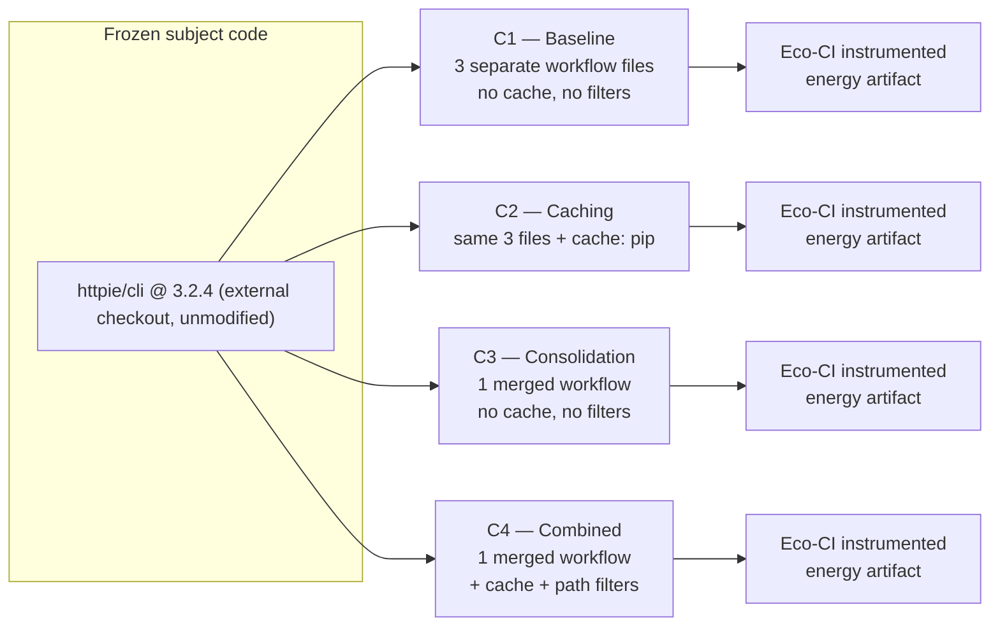
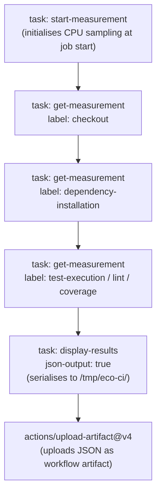
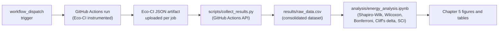

# Chapter 4: Design

## 4.1 Overview

Chapter 3 set out why a controlled, within-subjects experiment across four configurations is the right design for this study, and what each configuration is intended to isolate. This chapter presents the concrete technical implementation that realises that design: the pipeline architecture shared by every configuration, the exact per-project changes that distinguish C1 from C2, C3, and C4, the Eco-CI instrumentation pipeline that produces every energy figure in this dissertation, and the data flow that turns a single GitHub Actions run into a row in the analysis dataset. Where a calculation is involved, a worked numerical example is given and its provenance stated explicitly.

## 4.2 Pipeline Architecture

Every configuration checks out the same fixed, frozen subject code and differs only in how the surrounding pipeline is structured. Figure 4.1 shows the four configurations as parallel treatments of the same underlying checkout.


*Figure 4.1: The four experimental configurations as parallel, identically-instrumented treatments of the same frozen subject checkout.*

Holding the checkout identical across all four branches is what makes the comparison in Chapter 5 a test of pipeline configuration alone: any measured difference in energy between, say, C1 and C2 cannot be attributed to a change in what HTTPie does, because HTTPie itself never changes.

## 4.3 Configuration Scenarios in Detail

This section gives the exact, per-configuration implementation for the anchor project (HTTPie); the same pattern is applied to each subsequent project, adapted to its ecosystem per the cross-ecosystem considerations in Section 3.2.5.

**C1 — Baseline.** HTTPie's three pre-existing workflow files (`tests.yml`, `code-style.yml`, `coverage.yml`) are instrumented with Eco-CI but otherwise left structurally unchanged: three independent jobs, each provisioning its own runner, checking out the code, and installing dependencies from a cold cache.

**C2 — Caching.** The same three files as C1, with `cache: pip` added to every `setup-python` step. Because HTTPie declares its dependencies in `setup.cfg` rather than the more common `requirements.txt`, the cache key must be pointed explicitly at the correct file with `cache-dependency-path: setup.cfg` — without this, `actions/setup-python` cannot compute a cache key and caching silently falls back to a permanent cache miss.

**C3 — Consolidation.** The three workflow files are merged into a single `ci-consolidated.yml`, restructured as a sequential job chain: lint, then test, then coverage. This removes two of the three redundant runner-provisioning and checkout-and-install cycles while keeping the total amount of work identical to C1, isolating the consolidation effect from any change in what is actually executed.

**C4 — Combined.** The merged structure from C3, with caching from C2 applied throughout. Path-based trigger filtering, restricting a `push`/`pull_request` trigger so that changes touching only documentation or non-source paths do not run the pipeline at all, was part of C4's original design intent but is not present in any workflow file used in this study: every file, C4 included, is triggered exclusively via `workflow_dispatch` so that the protocol can dispatch an exact, controlled number of runs per configuration (Section 3.6). Consequently C4's measured energy reflects caching and consolidation combined, not path filtering, which remains unmeasured (Section 6.6).

Table 4.1 summarises the cross-ecosystem adaptation of the caching mechanism, extending Section 3.2.5.

| Ecosystem | Caching mechanism | Notes |
|---|---|---|
| Python (HTTPie) | `cache: pip` + `cache-dependency-path: setup.cfg` | Requires explicit path because HTTPie uses `setup.cfg`, not `requirements.txt` |
| JavaScript (got) | `cache: npm` | Keys against `package-lock.json` by default |
| Java (Retrofit) | `cache: gradle` | Keys against Gradle wrapper and lock files |
| Go (resty) | `cache: true` on `setup-go` | Covers two distinct caches: module cache (`~/go/pkg/mod`) and build cache (`~/.cache/go-build`) |

*Table 4.1: Idiomatic caching mechanism used for Configuration C2/C4 in each project ecosystem.*

## 4.4 Eco-CI Instrumentation Pipeline

Each job is instrumented with the Eco-CI Energy Estimation tool (`green-coding-solutions/eco-ci-energy-estimation@v5`) at four fixed points, shown in Figure 4.2.


*Figure 4.2: The Eco-CI instrumentation pattern applied to every job, in every configuration.*

Several implementation requirements were established during the pre-study audit (Appendix A) and applied uniformly across every workflow file:

- `continue-on-error: true` is set at step level on every Eco-CI step, so that a measurement-tool error does not abort the job.
- `if: always()` is set on the artifact upload, so that data is not lost when a test step fails.
- `cache-dependency-path: setup.cfg` is set on the C2 and C4 `setup-python` steps for HTTPie (Section 4.3).
- `fail-fast: false` is set on the test matrix, so that one Python version failing does not cancel measurement of the others.

The pre-study audit examined all four configurations before any data collection began and identified six critical configuration issues, including unresolved merge conflicts, missing `workflow_dispatch` triggers, and an incorrect YAML scope for `continue-on-error` that caused it to be silently ignored, plus two further issues discovered on first live execution: two `test_encoding.py` cases failing against a newer, transitively-resolved `charset_normalizer` release, and one `test_cli_ui.py` case failing only on Python 3.12 due to an `argparse` formatting change. Neither is a pipeline-configuration defect, and both are fixed identically across all four configurations and the full Python version matrix. Full audit findings and their fixes are documented in Appendix A. The subsequent migration to a single-repository architecture, in which all workflows live on one branch with the configuration encoded in the filename and the subject code checked out externally at a fixed tag, eliminated the entire class of branch-divergence issues the audit surfaced.

## 4.5 Measurement Stages

Energy is measured at the following stage boundaries, labelled consistently across all configurations. The stage commands shown are HTTPie's; equivalent stages are defined for each other project.

| Stage Label | Pipeline Phase (HTTPie) |
|---|---|
| `checkout` | `actions/checkout@v4`: repository clone |
| `dependency-installation` | `make install` / `make venv`: package installation |
| `lint` | `make codestyle`: static analysis |
| `test-execution` | `make test`: full test suite (Python 3.10, 3.11, 3.12 matrix) |
| `coverage` | `make test-cover`: test suite with coverage instrumentation |
| `dist-test` | `make test-dist`: distribution build validation |

*Table 4.2: Measurement stage boundaries mapped to HTTPie pipeline phases.*

## 4.6 Worked SCI Calculation Example

> **Provenance note.** The figures used in this worked example were collected during early pilot instrumentation testing of the C1 and C2 configurations, before the validated 30-run data-collection protocol (Section 3.5) was executed to completion. They are used here only to demonstrate the calculation mechanism concretely; they are not presented as a statistically validated result, and they are not repeated in Chapter 5 as evidence for RQ1–RQ3.

Eco-CI derives energy in three steps. First, it samples CPU utilisation at fixed intervals across the measurement window using the runner's kernel statistics. Second, it converts each utilisation reading into a power figure using a regression model trained on the SPECpower benchmark dataset (SPECpower_ssj2008), parameterised with the runner's machine profile and scaled down to the share of that power attributable to the job's allocated vCPUs, which is why reported power values are a few watts rather than the full draw of the host. Third, it integrates power over elapsed time: for each labelled stage, energy in joules is the average estimated power in watts multiplied by the stage duration in seconds.

Applied to the pilot C1 code-style job, the lint stage recorded an average CPU utilisation of 25.29%, which the model mapped to 4.07 W for the runner profile, over a duration of 17.26 seconds:

```
E(lint) = 4.07 W × 17.26 s = 70.25 J
```

The same relationship holds for every other stage in the job: checkout resolves to 4.10 W × 1.17 s = 4.79 J, and dependency-installation to 4.19 W × 11.57 s = 48.51 J, for a job total of 123.55 J.

Converting a run's total energy to a carbon figure applies the SCI formula from Section 3.6. The pilot C2 test matrix (three Python versions) recorded a total estimated energy of 1,484.12 J:

```
E   = 1,484.12 J ÷ 3,600,000 = 4.1226 × 10⁻⁴ kWh
SCI = E × I = 4.1226 × 10⁻⁴ kWh × 345 gCO₂eq/kWh = 0.1422 gCO₂eq per run
```

using the Irish grid intensity (I = 345 gCO₂eq/kWh). Only the intensity term changes when the same run is attributed to a different grid: substituting Norway's 25 gCO₂eq/kWh gives 0.0103 gCO₂eq, while Singapore's 408 gCO₂eq/kWh gives 0.1682 gCO₂eq, for energy that Eco-CI estimated identically in all three cases. This is the mechanism behind the multi-region analysis presented in Section 5.6: the energy term is a property of the configuration, while the intensity term is a property of where the runner happens to be.

## 4.7 Data Flow

Figure 4.3 traces a single measurement from the moment a workflow is triggered to the point it becomes a row in a results table in Chapter 5.


*Figure 4.3: End-to-end data flow from a triggered run to a reported result.*

Each stage in this pipeline is deterministic and scripted, so the same raw artifacts can be re-collected and re-analysed independently, which is the basis of the reproducibility claim in Section 3.8 and Appendix B.

---

